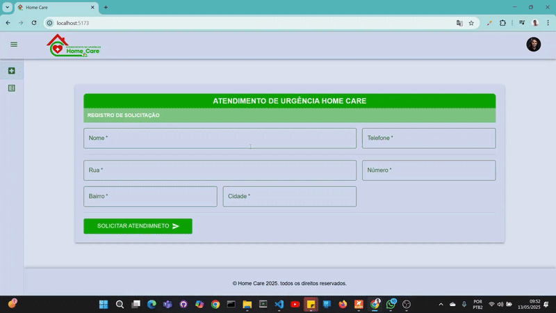

# home-care-app

Aplicação **web** para registro de atendimentos emergenciais em **home care**, desenvolvida com **React**, **Vite** e **Material UI**.

## Demostrção
<br/>

## 🧰 Tecnologias Utilizadas

- [React 18](https://reactjs.org/)
- [Vite](https://vitejs.dev/)
- [TypeScript](https://www.typescriptlang.org/)
- [Material UI](https://mui.com/)
- [React Router DOM](https://reactrouter.com/)
- [TanStack React Query](https://tanstack.com/query/latest)
- [Formik](https://formik.org/)
- [Yup](https://github.com/jquense/yup)
- [Day.js](https://day.js.org/)
- [Notistack](https://iamhosseindhv.com/notistack)
- [Material React Table](https://www.material-react-table.com/)

## ⚙️ Pré-requisitos

- [Node.js](https://nodejs.org/en/) v18 ou superior (recomendado: v22.15.0)
- [npm](https://www.npmjs.com/) ou [yarn](https://yarnpkg.com/)

## 🚀 Instalação

```bash
# Clone o repositório
git clone https://github.com/seu-usuario/home-care-app.git
cd home-care-app

# Instale as dependências
npm install
